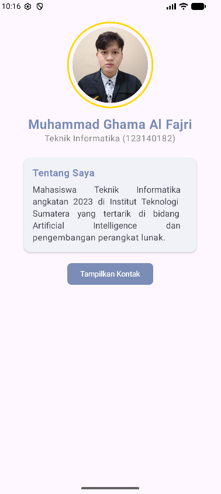
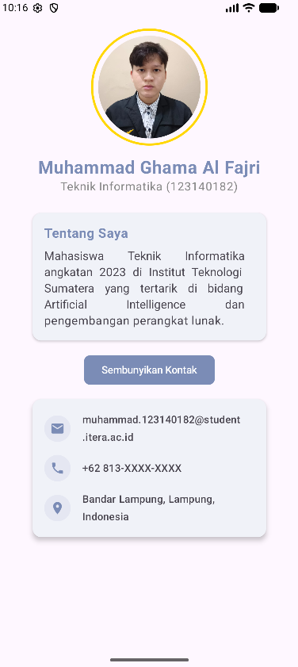

# ProfileGhama - My Profile App

- Nama: Muhammad Ghama Al Fajri
- NIM: 123140182

Aplikasi profil pribadi modern yang dibangun menggunakan **Compose Multiplatform**. Aplikasi ini menampilkan informasi profil pengguna dengan antarmuka yang bersih, animasi yang halus, dan tema warna kustom.

## ✨ Fitur Utama
- **Header Profil:** Menampilkan foto profil melingkar dengan bingkai emas (*gold ring*) yang elegan.
- **Kartu Tentang Saya:** Deskripsi singkat mengenai latar belakang dan minat.
- **Informasi Kontak Dinamis:** Menampilkan detail kontak (Email, Telepon, Lokasi) menggunakan animasi `AnimatedVisibility`.
- **Tema Kustom:** Desain menggunakan palet warna khusus `#7B8CB6` untuk memberikan kesan profesional dan modern.
- **Komponen Reusable:** Dibangun dengan fungsi Composable yang modular seperti `ProfileHeader`, `ProfileCard`, dan `InfoItem`.

## 🛠️ Teknologi yang Digunakan
- **Kotlin:** Bahasa pemrograman utama.
- **Compose Multiplatform:** UI Framework deklaratif untuk Android, iOS, dan Desktop.
- **Material 3:** Sistem desain terbaru dari Google untuk komponen UI.
- **Compose Resources:** Manajemen sumber daya (gambar/ikon) lintas platform.


## 🚀 Cara Menjalankan
1. **Prasyarat:** Pastikan Anda memiliki Android Studio (versi terbaru) dan JDK 17+.
2. **Clone Proyek:**
   ```bash
   git clone https://github.com/username/ProfileGhama.git
   ```
3. **Buka di Android Studio:** Pilih folder proyek `ProfileGhama`.
4. **Jalankan Aplikasi:**
   - Untuk **Android**: Pilih konfigurasi `composeApp` dan klik tombol **Run**.
   - Untuk **Desktop**: Jalankan perintah `./gradlew :composeApp:run` di terminal.

---

### 📸 Screenshot Aplikasi

  
