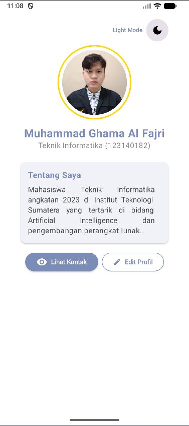
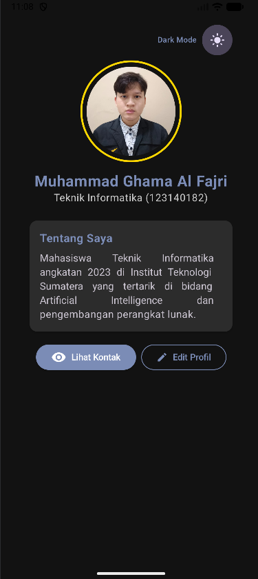
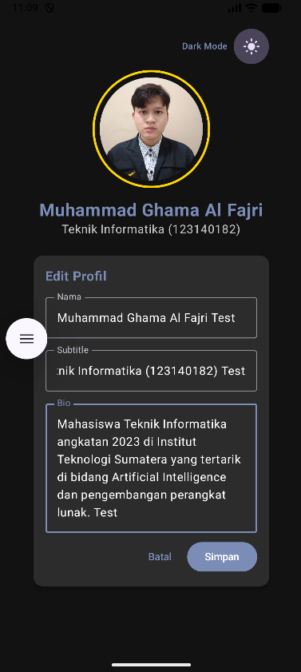
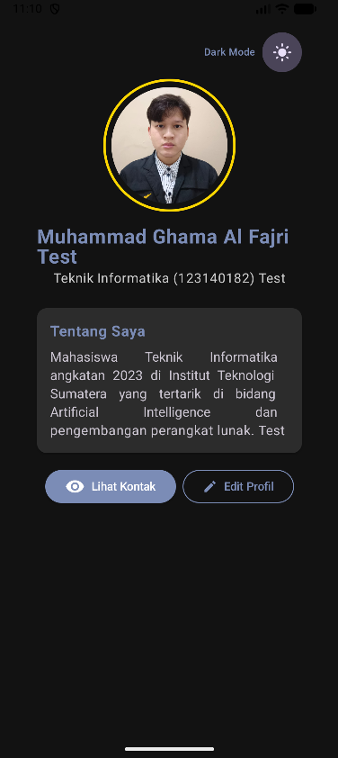

# ProfileGhama - My Profile App (Tugas Praktikum 3)

- Nama: Muhammad Ghama Al Fajri
- NIM: 123140182

Aplikasi profil pribadi modern yang dibangun menggunakan **Compose Multiplatform**. Aplikasi ini menampilkan informasi profil pengguna dengan antarmuka yang bersih, animasi yang halus, dan tema warna kustom.

## ✨ Fitur Utama
- **Header Profil:** Menampilkan foto profil melingkar dengan bingkai emas (*gold ring*) yang elegan.
- **Kartu Tentang Saya:** Deskripsi singkat mengenai latar belakang dan minat.
- **Informasi Kontak Dinamis:** Menampilkan detail kontak (Email, Telepon, Lokasi) menggunakan animasi `AnimatedVisibility`.
- **Tema Kustom:** Desain menggunakan palet warna khusus `#7B8CB6` untuk memberikan kesan profesional dan modern.
- **Komponen Reusable:** Dibangun dengan fungsi Composable yang modular seperti `ProfileHeader`, `ProfileCard`, dan `InfoItem`.

## 🛠️ Teknologi yang Digunakan
- **Kotlin:** Bahasa pemrograman utama.
- **Compose Multiplatform:** UI Framework deklaratif untuk Android, iOS, dan Desktop.
- **Material 3:** Sistem desain terbaru dari Google untuk komponen UI.
- **Compose Resources:** Manajemen sumber daya (gambar/ikon) lintas platform.


## 🚀 Cara Menjalankan
1. **Prasyarat:** Pastikan Anda memiliki Android Studio (versi terbaru) dan JDK 17+.
2. **Clone Proyek:**
   ```bash
   git clone https://github.com/username/ProfileGhama.git
   ```
3. **Buka di Android Studio:** Pilih folder proyek `ProfileGhama`.
4. **Jalankan Aplikasi:**
    - Untuk **Android**: Pilih konfigurasi `composeApp` dan klik tombol **Run**.
    - Untuk **Desktop**: Jalankan perintah `./gradlew :composeApp:run` di terminal.

---

### 📸 Screenshot Aplikasi

  

# Tugas Praktikum 4

Pada pembaruan ini, aplikasi telah dikembangkan lebih lanjut dengan menerapkan pola arsitektur MVVM dan penambahan beberapa fitur interaktif baru sesuai dengan ketentuan Tugas Praktikum Minggu 4.

### ✨ Fitur Baru (Minggu 4)

1.  **Implementasi MVVM Pattern:**

      - Memisahkan logika bisnis dari UI menggunakan `ProfileViewModel`.
      - Mengelola state aplikasi menggunakan `StateFlow`.
      - Menambahkan data class `ProfileUiState` untuk merangkum seluruh state UI (nama, bio, mode gelap, status edit).

2.  **Fitur Edit Profil:**

      - Menyediakan form interaktif bagi pengguna untuk mengubah data Nama, Subtitle, dan Bio.
      - Menggunakan konsep *State Hoisting* pada komponen `TextField` agar state dapat dikelola dengan baik.
      - Tombol "Simpan" yang secara langsung memperbarui data di dalam ViewModel.

3.  **Fitur Dark Mode Toggle:**

      - Menambahkan tombol *switch* (ikon toggle) interaktif untuk mengubah tema antara *Light Mode* dan *Dark Mode*.
      - Status tema disimpan dan dikelola melalui ViewModel, diiringi dengan animasi transisi warna latar belakang dan teks yang halus.

### 📁 Struktur Folder

Pembaruan ini juga mendukung restrukturisasi kode menjadi lebih modular:

  - `ui/`: Berisi seluruh komponen Composable UI (ProfileScreen, EditForm, ProfileCard, dll).
  - `viewmodel/`: Berisi `ProfileViewModel` sebagai pengelola *state* dan *business logic*.
  - `data/`: Berisi *data class* `ProfileUiState` (serta pengaturan *persistence* jika ada).

### 📸 Screenshot Aplikasi (Tugas 4)

**Tampilan Profil & Dark Mode Toggle dan Perbandingan Mode Light dan Dark**
<br>
 

**Tampilan Form Edit Profil**
<br>


**Tampilan Setelah Edit Form**
<br>

