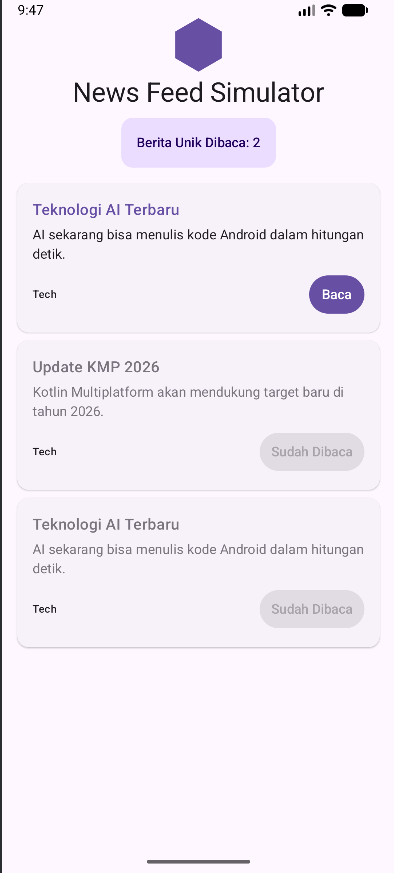
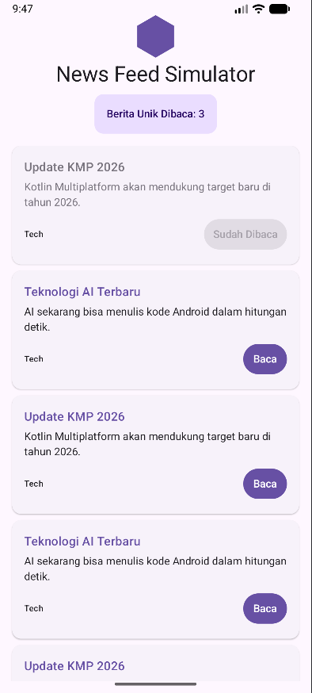

# Tugas Praktikum 2: News Feed Simulator

* **Nama:** Muhammad Ghama Al Fajri
* **NIM:** 123140182

Aplikasi **News Feed Simulator** dibangun menggunakan **Kotlin Multiplatform (KMP)** dan **Compose Multiplatform**. Proyek ini bertujuan untuk mengimplementasikan *Asynchronous Programming* menggunakan Kotlin Coroutines dan aliran data reaktif menggunakan Kotlin Flow.

---

### ✨ Fitur Utama (Sesuai Persyaratan Tugas)

Aplikasi ini telah memenuhi 5 kriteria utama dari tugas praktikum:

1. **Simulasi Data dengan Flow:** Menggunakan `flow {}` builder untuk memancarkan (emit) data berita baru secara berurutan dengan jeda waktu (`delay`) secara simulasi.
2. **Filter Kategori Berita:** Menggunakan operator `.filter {}` pada Flow untuk hanya menyaring dan mengalirkan berita dengan kategori spesifik (contoh: "Tech").
3. **Transformasi Data:** Data berita yang mentah diubah (*transform*) formatnya sebelum dikumpulkan dan ditampilkan ke antarmuka pengguna (UI).
4. **State Management dengan StateFlow:** Menggunakan `StateFlow` untuk menyimpan, mengamati, dan memperbarui *state* jumlah berita unik yang telah dibaca oleh pengguna secara *real-time*.
5. **Coroutines untuk Async Task:** Menggunakan *suspend functions* (`delay`, `withContext`) dan *CoroutineScope* untuk mensimulasikan pengambilan detail berita secara *asynchronous* (tanpa memblokir *Main/UI Thread*) saat tombol "Baca" ditekan.

---

### 🛠️ Teknologi & Arsitektur
* **Bahasa:** Kotlin
* **UI Framework:** Compose Multiplatform (Material 3)
* **Asynchronous:** Kotlinx Coroutines (`launch`, `Dispatchers.Default`)
* **Reactive Streams:** Kotlin Flow, StateFlow
* **Struktur Proyek:** KMP Single-Module (`composeApp`)

---

### 🚀 Cara Menjalankan Aplikasi

Pastikan Anda telah menginstal JDK 17 (atau lebih baru) dan Android Studio terbaru.

**1. Menjalankan di Android Emulator / Device:**
* Buka proyek ini menggunakan Android Studio.
* Tunggu hingga proses *Gradle Sync* selesai.
* Pada *toolbar* atas, pilih konfigurasi **`composeApp`** dan pilih perangkat/emulator Android Anda.
* Klik tombol **Run** (Ikon Segitiga Hijau) atau gunakan *shortcut* `Shift + F10`.

*Atau melalui terminal:*
```bash
./gradlew :composeApp:installDebug

```

**2. Menjalankan di Desktop (JVM):**
Aplikasi ini juga mendukung platform Desktop karena menggunakan Compose Multiplatform.
Buka terminal di dalam Android Studio dan jalankan perintah berikut:

```bash
./gradlew :composeApp:run

```

---

### 📸 Screenshot Aplikasi

  
